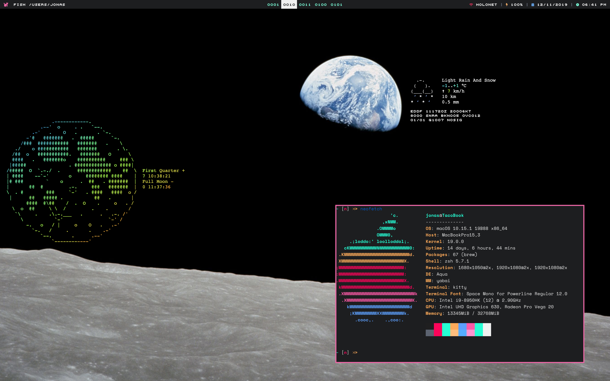

# TacoDot

This repo fullfills two purposes:
* Of course this is my personal backup - if something happens to my precious ;)
* For everyboy who likes my setup and wants to use it him/herself

For some people the colors will truly be shocking. I personally enjoy it a bit
more "trashy" so don't hate! The colors are all taken from a syntax theme that I
personally enjoy: [Panda](https://panda.siamak.work/). All of the provided
config files are obviously easiest to use by just symlinking at their correct
spot.

This repository includes both config files for macOS and GNU/Linux. Currently I
am running solely the macOS config files on my 2018 15'' MBP.

# Quick Overview?
* Window Manager (macOS): [yabai](https://github.com/koekeishiya/yabai)
* Window Manager (GNU/Linux): [herbstluftwm](https://herbstluftwm.org/)
* Text Editor: [vim](https://www.vim.org/)
* Shell: [fish](https://fishshell.com/)
* Terminal Emu: [kitty](https://github.com/kovidgoyal/kitty)

# What Other Utilities are Required?
That truly depends on the OS. To have the full functionality working, you will
need the following additional software:

## macOS
* [Übersicht](http://tracesof.net/uebersicht/)
* [jo](https://github.com/jpmens/jo)
* [jq](https://stedolan.github.io/jq/)
* [aha](https://github.com/theZiz/aha)

## GNU/Linux
* [rofi](https://github.com/DaveDavenport/rofi)
* [nm-applet](https://wiki.archlinux.org/index.php/NetworkManager)
* [networkmanager_dmenu](https://github.com/firecat53/networkmanager-dmenu)
* [playerctl](https://github.com/acrisci/playerctl)
* [wifi-tools](https://hewlettpackard.github.io/wireless-tools/Tools.html)
* [pamixer](https://github.com/cdemoulins/pamixer)
* [slock](https://tools.suckless.org/slock/)
* [feh](https://feh.finalrewind.org/)
* [autorandr](https://github.com/phillipberndt/autorandr) (in case you wanna
    store some special monitor setup)

Have fun!
