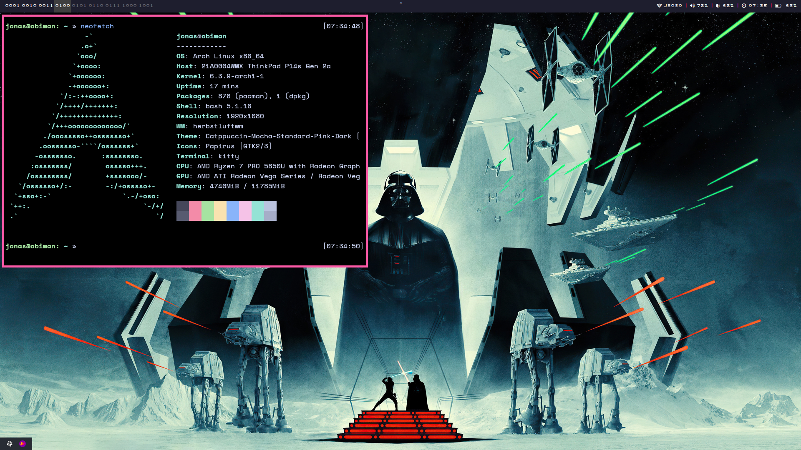

# dot

This repo fullfills two purposes:
* Of course this is my personal backup - if something happens to my precious ;)
* For everyboy who likes my setup and wants to use it him/herself

For some people the colors will truly be shocking. I personally enjoy it a bit
more "trashy" so don't hate! The colors are all taken from a syntax theme that
I personally enjoy: [catpuccin](https://github.com/catppuccin/catppuccin). All
of the provided config files are obviously easiest to use by just symlinking at
their correct spot.

This repository includes both config files for macOS and GNU/Linux. This branch
represents the config files for my Lenovo ThinkPad P14s running Arch Linux.

# Quick Overview?
* Window Manager: [herbstluftwm](https://herbstluftwm.org/)
* Editor: [neovim](https://neovim.io/)
* Shell: [fish](https://fishshell.com/)
* Terminal Emu: [kitty](https://github.com/kovidgoyal/kitty)

# What Other Utilities are Required?
To have the full functionality working, you will need the following additional
software:

* [rofi](https://github.com/DaveDavenport/rofi)
* [nm-applet](https://wiki.archlinux.org/index.php/NetworkManager)
* [networkmanager_dmenu](https://github.com/firecat53/networkmanager-dmenu)
* [slock](https://tools.suckless.org/slock/)
* [feh](https://feh.finalrewind.org/)
* [autorandr](https://github.com/phillipberndt/autorandr) (in case you wanna
    store some special monitor setup)

Have fun!
